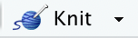
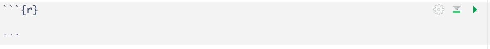

# R Markdown

R Markdown is a super versatile tool! Most of my lectures and assignments are actually built with R Markdown. `.Rmd` is the file extension for R Markdown documents.

R Markdown allows you to create data analysis documents which combine text, code, and figures. I recommend R Markdown for organizing and presenting your code and analysis.

Below are instructions to help you get started with R Markdown if you haven't used it before.

## Download the activity R Markdown template

For Activity 2, I have provided a template R Markdown document (`ca_02_template.Rmd`) for you to fill in:

**Step 1:** Download the Activity 2 template file: [ca_02_template.Rmd](https://sta175-s22.github.io/class_activities/ca_02_template.Rmd). Save it somewhere on your computer that you can find it easily (e.g., a folder on your desktop).

**Step 2:** Rename the file to `ca_02_your_name.Rmd` (so, for example, I would call it `ca_02_ciaran_evans.Rmd`).

**Step 3:** Open `ca_02_your_name.Rmd` in RStudio.

**Step 4:** Click the `knit` button  at the top of the document. The knitted document is an HTML file that you can share. You will re-knit your R Markdown file as you continue your analysis.

## Components of an R Markdown document

### The YAML
At the very top the document, there is a section bordered by `---`. This is called the YAML, and it contains information about how to display our document. 

**Step 5:** In the YAML, change `author` from `Your Name` to your actual name (keep the quotes). For example, I would do
```
author: "Ciaran Evans"
```
Now knit the document again; your name is now displayed at the top.

### Code chunks

R Markdown is great because we can include code directly in the document. This makes it *reproducible*, because the file contains all the code we used for a data analysis. We include R code in special blocks called *chunks*. These look like


In Activity 2, you will use one chunk for each question. You can see that I have included them for you in the template. You will fill them in as you go through the activity.

There is also a chunk at the beginning that we call the *setup* chunk. This is where we will do things like import data and load packages. For activity 2, you will need the `tidyverse` package, so it has been included in the setup.

**Step 6:** Click the `Run` button  on the right of the setup chunk. The `Run` button runs code so you can experiment with data before knitting the R Markdown document.

### Text

Text you write outside of code chunks is displayed normally in the knitted HTML document. For example, `Type your answer to question 1 here...` is displayed under Question 1.

The `##` is used to denote a *header*. For example, `## Exercise 1` is displayed as

after you knit. The number of `#` controls how big the header is (more `#` --> smaller).

You're now ready to start working with the data! 
