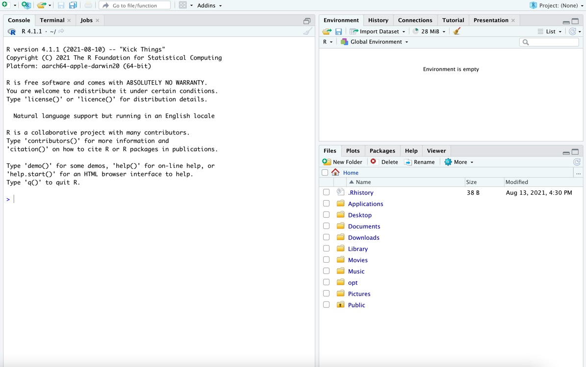

# Software 

The resources on this site use R and RStudio for data analysis, visualization, and reports. R is the statistical software, while RStudio is an environment that makes it easy to manage and use that software. Below are instructions for installing R and RStudio (steps 1--5). 

If you are new to R or RStudio, you have two choices to gain access to the software.

     Option 1: You can access RStudio Cloud online.
     Option 2: You can start download the software you need.
     
Both options are free! We discuss both, and provide you the resources you need to install what you need, below. 

# Option 1: RStudio Cloud

To learn how to get started on RStudio Cloud, [follow this link](). 

- Advantages: Using RStudio Cloud means you do not have to install anything on your computer! 
- Disadvantages: There is a time limit (25 hours) for how long you can use RStudio Cloud for free. After that, there is a small fee.

# Option 2: Downloading R and RStudio onto your computer

- Advantages: This means you have unlimited access to R and RStudio for free. 
- Disadvantages: There are sometimes challenges involved with installing everything on your computer depending on your machine and operating system. You are also limited by the amount of memory and free space on your computer. 

To install R and RStudio on your computer, folllow the steps below (steps 1--5). 

1. Install R: go to [this link](https://mirror.las.iastate.edu/CRAN/), and choose the download option for your operating system.
    a. Windows: Click **Download R for Windows**, then click the **install R for the first time** button.
    b. macOS: Click **Download R for macOS**. Under *Latest release*, choose the package corresponding to your macOS version.
    c. Linux: Click **Download R for Linux**, then select your distro and follow the installation instructions (you will install via the command line).
2. Install RStudio: go to [this link](https://www.rstudio.com/products/rstudio/download/), and click the **Download** button under RStudio Dekstop. Then, click **Download** on the following screen.
3. Open RStudio (the icon is a white R in a blue circle). You should see something like the following:

4. We'll get acquainted with RStudio in class. For now, let's just check that it works. The panel to the bottom left of the screen is called the **console**. Next to the `>`, type `16 * 7` and hit **Enter** (or **return** on Mac). You should get `112`.
5. Finally, we'll do one more setup step. In the console, copy and paste the following lines of code, and hit enter.

```R
install.packages("tinytex")
tinytex::install_tinytex()
```

It may take a few minutes to run. If using macOS, you may need to enter your password in the installation process.
